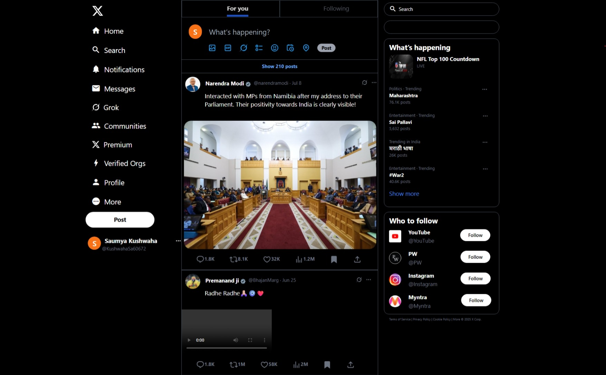

# X.com_clone
# 👋 Hi, I'm Saumya Kushwaha

I'm a Computer Science student at Rama University and a detail-driven front-end developer passionate about crafting responsive and user-centric web interfaces. I thrive on solving layout quirks, optimizing design flow, and building clean UI clones that feel intuitive and modern.
## 📌 About This Repository

A responsive front-end clone of X.com (formerly Twitter) built using **Tailwind CSS**, structured with semantic HTML, and deployed via **Vercel**.  
Inspired by modern UI patterns to replicate a familiar social feed experience — from sidebars to tweet cards!

## 🔗 Live Demo  
[Click here to view the deployed project](https://x-com-clone-qtphwx9d0-saumya-kushwahas-projects.vercel.app)

## 💻 Technologies Used
- 🌐 HTML5  
- 🎨 Tailwind CSS  
- 🚀 Vercel (for hosting)

## 📸 Preview




## 📁 Project Structure
<pre>
X.com_clone/
├── index.html
├── src/
│   ├── input.css        
│   └── output.css        
├── tailwind.config.js    
├── package.json         
├── package-lock.json    
├── .gitignore            
├── /screenshots
</pre>     

## 🛠️ Features
- Responsive layout that adapts across screen sizes  
- Sidebar navigation similar to X.com  
- Modern tweet card design with hover effects  
- Minimal, accessible structure  
- Clean code and scalable components

## 🧠 What I Learned
- Handling Git and GitHub push errors (like GH007 & RPC curl fail 😅)  
- Configuring SSH keys for secure authentication  
- Deploying via Vercel linked to GitHub  
- Debugging layout issues between local and deployed view  
- Importance of viewport meta tag and container padding

## 📦 Getting Started

To run locally:

```bash
# Clone the repository
git clone https://github.com/saumya-2005/X.com_clone.git
cd X.com_clone

# Install Tailwind CSS (if needed)
npm install

# Start watching and compiling Tailwind styles
npx tailwindcss -i ./src/input.css -o ./src/output.css --watch
```

## 👩‍💻 Author

**Saumya Kushwaha**  
📍 Kanpur, India  
🎓 B.Tech in Computer Science, Rama University  
💼 Front-end developer focused on responsive layouts, creative UI clones, and practical learning through hands-on projects.

🔗 [GitHub Profile](https://github.com/saumya-2005)
